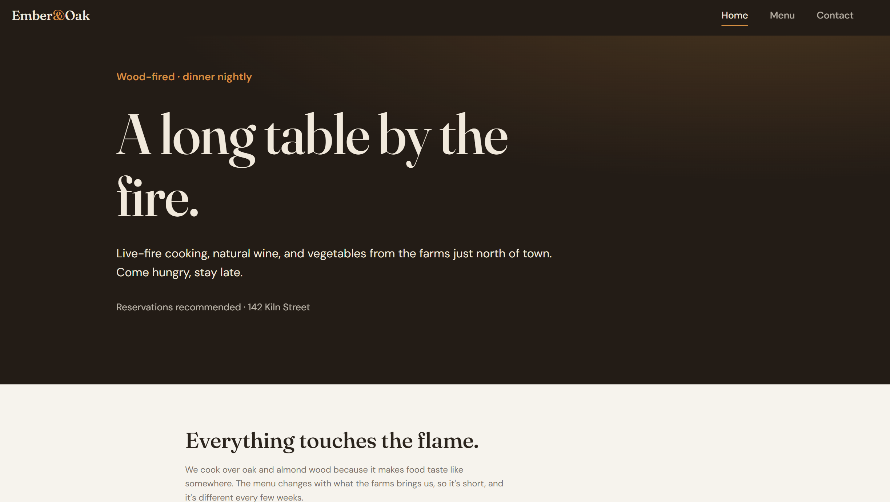

# Restaurant Page

A single-page restaurant site with tabbed navigation, where **every element on the page is generated dynamically with JavaScript** and the whole project is bundled with **webpack**. Built to practice structuring an app across ES6 modules and shipping it through a real build-and-deploy toolchain.

**Live demo:** https://dani-sink.github.io/project-restaurant-page-/
**Repo:** https://github.com/dani-sink/project-restaurant-page-

<!-- Replace with a real screenshot or (better) a GIF of switching between tabs. -->



## What it demonstrates

- **Webpack** — a full build setup: entry/output config, `HtmlWebpackPlugin`, CSS loaders, the dev server, and deployment of the bundled `dist/` output.
- **ES6 modules** — the page is split across modules, with one module per tab, each exporting a function that builds its own content.
- **Dynamic DOM generation** — the HTML template ships nearly empty (just a container); all headings, menu items, and contact details are created in JavaScript with `createElement` and appended at runtime.
- **Tabbed single-page navigation** — clicking a tab clears the content container and renders the selected tab, with no page reload.
- **Deployment** — the built site is published to GitHub Pages from the `gh-pages` branch.

## Features

- Tabbed navigation between **Home**, **Menu**, and **Contact**
- All page content generated in JavaScript — nothing hardcoded in the HTML body
- A custom visual design (warm dark hero, amber accent, serif display type)
- Responsive layout that holds up from desktop down to mobile

## Built with

- HTML5 &amp; CSS3
- Vanilla JavaScript (ES6 modules)
- webpack (with `html-webpack-plugin`, `style-loader`, `css-loader`)
- Deployed on GitHub Pages

## Running locally

```bash
git clone https://github.com/dani-sink/project-restaurant-page-.git
cd project-restaurant-page-
npm install
npx webpack serve      # dev server at http://localhost:8080
```

To build the production bundle into `dist/`:

```bash
npx webpack
```

## What I learned

<!-- Rewrite this in your own words — a genuine reflection is what makes a project read as real work rather than a copied tutorial. Draft based on this project: -->

- Keeping `template.html` nearly empty and building every element in JavaScript made me structure the app as one module per tab, each responsible for its own DOM — a much cleaner separation than piling everything into one file.
- Setting up webpack from scratch (loaders, the HTML plugin, the dev server) and then deploying the bundled output to GitHub Pages taught me the full path from source code to a live site, not just writing the code.
- The trickiest part was the tooling around the code rather than the code itself — getting the build, the dev-server live reload, and the `gh-pages` deployment all working end to end.

## Possible improvements

- Add an image to the hero, loaded through webpack's asset handling
- Smooth transitions when switching between tabs
- A reservations or contact form

---

_Built as part of The Odin Project's Full Stack JavaScript path._
